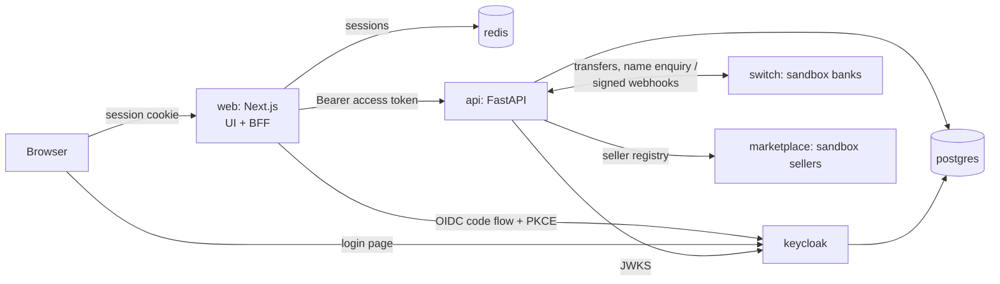

# Mandate Gate

Lets an AI assistant buy things for you with your bank account, without being able to spend your money in ways you didn't agree to.

You sign a **mandate**: exact limits such as the item, maximum total, allowed sellers and a delivery deadline. A Qwen-based shopping agent finds and proposes a cart, and a rule-based **gate** outside the AI decides whether money can move. The gate checks the cart against your mandate, and checks with the bank that the account being paid really belongs to the seller. Payments are bank transfers, which can't be undone, so the check happens before the money leaves. The design and milestones are in [`system_design.md`](system_design.md).

> **Status: M7 (gate and payments).** The whole path is real. Qwen drafts a mandate from the shopper's sentence (every value must quote their own words), and the shopper signs the exact limits with a passkey. A worker runs the Qwen shopper against the sandbox marketplace, progress streams live to the browser, and the gate decides on the proposed cart. Approving it is a passkey signature over the seller-signed cart; the gate runs again inside the payment transaction, the money is held and sent by bank transfer, and the purchase gets a signed receipt anyone can check at /verify. Sellers see their paid orders. The ledger is in naira. Every model call goes through the LLM gateway (shared fair rate limits in Redis, retries, circuit breaker, cache, budgets, inference log); without `GROQ_API_KEY` a scripted sandbox provider stands in for the model and says so. Still mock data: disputes and refunds (M12), evaluations (M8), the test-marketplace report (M9) and admin users. The previous product (Scan-to-Confirm, a wallet with signed QR receipts) is in git history, and its designs are in `docs/archive/`.

## Run it

Requirements: Docker Desktop (with Compose).

```bash
cp .env.example .env      # first time only; a ready-to-use .env is already included
docker compose up --build
```

When all eight services are healthy (with the default `.env`):

| What | URL |
|---|---|
| **Web app** | http://localhost:3000 |
| API docs (Swagger) | http://localhost:8000/docs |
| Keycloak admin console | http://localhost:8080/admin (admin / admin) |
| Sandbox payment network (Swagger) | http://localhost:8100/docs |
| Sandbox marketplace (Swagger) | http://localhost:8200/docs |

Use `localhost`, not `127.0.0.1`. The sign-in redirect and CSRF checks are set up for `http://localhost:3000`.

**Using Qwen on Groq.** Put your key in `.env` as `GROQ_API_KEY=...` (never commit it or paste it anywhere else), then `docker compose up -d api worker`. Check what the model supports with:

```bash
docker compose run --rm --no-deps --entrypoint "python -m app.scripts.groq_live_check" api
```

Set `LLM_REQUESTS_PER_MINUTE` and `LLM_TOKENS_PER_MINUTE` to your Groq account's limits: every worker shares them.

**Passkeys.** Mandates are signed with a passkey (fingerprint, face or screen lock). Browsers only allow passkeys on the host in `WEBAUTHN_RP_ID`, so open the app at `http://localhost:3000`. Shoppers manage their passkeys under Security. Test scripts sign with a labelled test signature instead, which needs `ALLOW_TEST_SIGNATURES=true`; set it to false anywhere real.

**Upgrading an existing install** (one that was running before M1): update Keycloak's roles in place. Users and data are kept.

```bash
node infra/keycloak/migrate-roles-v5.mjs
```

### Demo accounts

All passwords are `demo1234`. New sign-ups are shoppers.

| Username | Role | Workspace |
|---|---|---|
| `sam` | Shopper | Mandates, AI shopping, purchases, balance |
| `ada` | Seller (Ada's Provisions) | Orders, catalog, bank accounts |
| `morgan` | Support analyst | Blocked carts, disputes, sellers |
| `olivia` | Ops / LLM engineer | Overview, agent versions, run traces, evaluations, test marketplace, platform ledger |
| `kemi` | Admin | Seller directory, users |
| `rita`, `jordan` | Shopper | Other shoppers in the sandbox |

## Configuration

Every setting lives in **`.env`** at the repository root. Docker Compose reads it and passes each value to the service that needs it:

| Where it goes | How |
|---|---|
| Postgres, API, web server | Environment variables set in `docker-compose.yml` from `.env` |
| Keycloak realm (client secret, redirect URLs, audience, demo passwords) | `${…}` placeholders in `infra/keycloak/realm-scan-to-confirm.json`, filled when the realm is first imported |
| Browser bundle (`NEXT_PUBLIC_*`) | Build arguments for the web image |

`.env.example` documents every variable and marks the ones to change outside local development. `.env` itself is git-ignored.

**Mock API.** With `NEXT_PUBLIC_API_MOCKS=true` (the default), endpoints the backend doesn't have yet are served in the browser from [`web/src/mocks`](web/src/mocks):
- mandates, AI shopping runs, carts, gate decisions, purchases and receipts;
- sellers, support queues, agent versions, evaluations and test-marketplace reports.

Real endpoints (session, banks, name enquiry, ledger) always go to the API. As each backend milestone ships, its mock routes are deleted and the screens use the real API with no other changes. Mock state resets when the page reloads.

## Architecture



| Service | Role |
|---|---|
| `web` | Next.js 16 (Redux Toolkit / RTK Query, Tailwind), organised by feature. Its server is the **backend-for-frontend**: it runs the Keycloak sign-in, keeps tokens in Redis, and proxies `/api/v1/*` to the API with the user's access token. The browser only holds an opaque httpOnly cookie. |
| `api` | FastAPI + SQLAlchemy. Verifies every Keycloak access token. Owns mandates, runs and traces, the gate, the LLM gateway (`app/llm`), the agent (`app/agent`, prompts versioned as files), the seller directory and cart verification, the double-entry ledger and transfers. Alembic migrations run on start. |
| `switch` | Sandbox inter-bank payment network with four fictional banks: name enquiry, transfers, status queries, signed webhooks, settlement report. |
| `worker` | AI shopping runs (same image as `api`): takes runs off the Redis queue, interactive first, and runs the agent loop. Scale with `docker compose up -d --scale worker=N` or `WORKER_CONCURRENCY`. |
| `marketplace` | Sandbox sellers (FastAPI): 20 honest and 3 dishonest, structured and photo-only catalogs (rendered with Pillow), delivery quotes, carts signed with each seller's Ed25519 key, and ground-truth labels for evaluating image reading. |
| `keycloak` | Identity provider (OIDC). Roles: shopper, seller, analyst, ops, admin. |
| `postgres` | App database and Keycloak's database. Ledger tables are append-only at the database level. |
| `redis` | Web sessions and sign-in state; the run queue; live run events; shared model rate limits, circuit breakers, budgets and the model-answer cache. |

## Evaluation

Every agent release is measured on the real model with the same test sets (`services/api/evals/datasets`), and the result is committed
next to the prompts as `services/api/evals/reports/<release>.json`. CI runs the release gate on those reports; it calls no model.

```bash
# In the api container (needs GROQ_API_KEY). Evaluations use their own token budget and the lowest priority.
docker compose exec api python -m app.evals run --release shopper-2026.09.6            # all suites
docker compose exec api python -m app.evals run --release shopper-2026.09.5 --model openai/gpt-oss-120b   # model comparison
docker compose exec api python -m app.evals gate                                        # exit 1 if a candidate is worse than live
docker compose exec api python -m app.evals snapshot-catalog                            # refresh the photo-catalog test set
```

Each suite result has a fingerprint of what produced it (prompt texts, models, settings, schemas, test set, and the code around the model).
Change any of them and the gate calls the result out of date until you re-run it. Suites whose fingerprint didn't change are reused, not
paid for again. The same verdict is on the Evaluations page (ops).

## Tests

```bash
# Unit tests (no database needed), the generated gate tests, and the release gate on the committed evaluation reports.
# CI (.github/workflows/ci.yml) runs these and the web checks below.
docker compose run --rm --no-deps --entrypoint "python -m pytest -q -p no:cacheprovider" api
docker compose run --rm --no-deps --entrypoint "python -m pytest -q -p no:cacheprovider" marketplace

# Web: types and lint
cd web && npx tsc --noEmit && npx eslint src

# End-to-end, with the stack running
node web/scripts/smoke-login.mjs             # Sign-in for every role, role pages, BFF proxy, CSRF, sign-out (non-destructive)
node services/marketplace/tests/smoke_marketplace.mjs  # Browse, signed carts, cart verification, tampering and payee substitution caught, directory, seller workspace, tiers
node services/api/tests/smoke_agent.mjs      # Mandate → AI run followed live (SSE) → gate decisions → approved cart paid, cancel, ops and support views
node services/api/tests/smoke_payments.mjs   # Paying: receipt, 20 clicks pay once, 50 parallel approvals vs a 5-purchase mandate, cancel mid-payment, low funds, gate re-run, seller orders
node services/api/tests/smoke_access.mjs     # Every role against another user's mandates, carts, purchases and passkeys (141 checks)
node services/api/tests/load_fairness.mjs    # 20 shoppers + 1 heavy shopper at once share the model rate limit fairly (run with --scale worker=4)
node services/api/tests/smoke_interbank.mjs  # Inter-bank payments through the sandbox switch (~90 s, non-destructive)
```

The payment and access tests create test data and spend sandbox money (topping the shopper up by bank transfer when needed); they reset nothing. The unit tests include generated tests of the gate (`tests/test_gate_properties.py`, Hypothesis).

`services/api/tests/smoke_api.mjs` tests the previous product's wallet API and **resets the demo data** when it finishes.

## Repository layout

```text
docker-compose.yml       The whole stack (all settings come from .env)
.env.example             Every configuration variable, documented
infra/keycloak/          Realm import and the M1 role migration
infra/postgres/init/     Creates Keycloak's database
services/api/            FastAPI service
services/switch/         Sandbox inter-bank payment network
services/marketplace/    Sandbox sellers, catalogs and signed carts
web/                     Next.js app: src/features/* per feature, src/mocks for the mock API
system_design.md         Design and milestones
docs/archive/            Earlier designs
```

## Not production-ready

- No real money: payments run on sandbox banks. A launch needs a licensed payment partner.
- The receipt signing key's private half is stored in Postgres; production uses a KMS.
- The `scan-cli` Keycloak client allows password login for tests only. Disable it in production.
- The values in `.env.example` are development defaults. Replace everything marked CHANGE before deploying anywhere shared.
