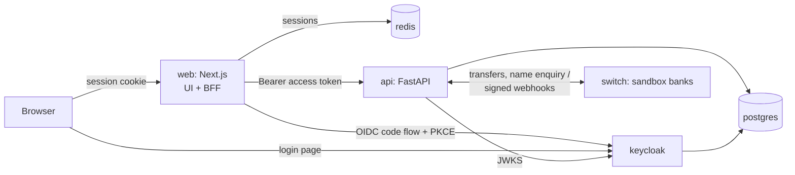

# Mandate Gate

Lets an AI assistant buy things for you with your bank account, without being able to spend your money in ways you didn't agree to.

You sign a **mandate**: exact limits such as the item, maximum total, allowed sellers and a delivery deadline. A Qwen-based shopping agent finds and proposes a cart, and a rule-based **gate** outside the AI decides whether money can move. The gate checks the cart against your mandate, and checks with the bank that the account being paid really belongs to the seller. Payments are bank transfers, which can't be undone, so the check happens before the money leaves. The design and milestones are in [`system_design.md`](system_design.md).

> **Status: M1 (reset and UI foundation).** The app has a workspace for each role, running on mock data. The AI shopper, mandates, gate and test marketplace are built in later milestones. The previous product (Scan-to-Confirm, a wallet with signed QR receipts) is in git history, and its designs are in `docs/archive/`.

## Run it

Requirements: Docker Desktop (with Compose).

```bash
cp .env.example .env      # first time only; a ready-to-use .env is already included
docker compose up --build
```

When all six services are healthy (with the default `.env`):

| What | URL |
|---|---|
| **Web app** | http://localhost:3000 |
| API docs (Swagger) | http://localhost:8000/docs |
| Keycloak admin console | http://localhost:8080/admin (admin / admin) |
| Sandbox payment network (Swagger) | http://localhost:8100/docs |

Use `localhost`, not `127.0.0.1`. The sign-in redirect and CSRF checks are set up for `http://localhost:3000`.

**Upgrading an existing install** (one that was running before M1): update Keycloak's roles in place. Users and data are kept.

```bash
node infra/keycloak/migrate-roles-v5.mjs
```

### Demo accounts

All passwords are `demo1234`. New sign-ups are shoppers.

| Username | Role | Workspace |
|---|---|---|
| `sam` | Shopper | Mandates, AI shopping, purchases, balance |
| `ada` | Seller (Ada's Provisions) | Orders, catalog, bank accounts |
| `morgan` | Support analyst | Blocked carts, disputes, sellers |
| `olivia` | Ops / LLM engineer | Overview, agent versions, run traces, evaluations, test marketplace, platform ledger |
| `kemi` | Admin | Seller directory, users |
| `rita`, `jordan` | Shopper | Other shoppers in the sandbox |

## Configuration

Every setting lives in **`.env`** at the repository root. Docker Compose reads it and passes each value to the service that needs it:

| Where it goes | How |
|---|---|
| Postgres, API, web server | Environment variables set in `docker-compose.yml` from `.env` |
| Keycloak realm (client secret, redirect URLs, audience, demo passwords) | `${…}` placeholders in `infra/keycloak/realm-scan-to-confirm.json`, filled when the realm is first imported |
| Browser bundle (`NEXT_PUBLIC_*`) | Build arguments for the web image |

`.env.example` documents every variable and marks the ones to change outside local development. `.env` itself is git-ignored.

**Mock API.** With `NEXT_PUBLIC_API_MOCKS=true` (the default), endpoints the backend doesn't have yet are served in the browser from [`web/src/mocks`](web/src/mocks):
- mandates, AI shopping runs, carts, gate decisions, purchases and receipts;
- sellers, support queues, agent versions, evaluations and test-marketplace reports.

Real endpoints (session, banks, name enquiry, ledger) always go to the API. As each backend milestone ships, its mock routes are deleted and the screens use the real API with no other changes. Mock state resets when the page reloads.

## Architecture



| Service | Role |
|---|---|
| `web` | Next.js 16 (Redux Toolkit / RTK Query, Tailwind), organised by feature. Its server is the **backend-for-frontend**: it runs the Keycloak sign-in, keeps tokens in Redis, and proxies `/api/v1/*` to the API with the user's access token. The browser only holds an opaque httpOnly cookie. |
| `api` | FastAPI + SQLAlchemy. Verifies every Keycloak access token. Owns the double-entry ledger, transfers, Ed25519 signing and ledger reports. Alembic migrations run on start. |
| `switch` | Sandbox inter-bank payment network with four fictional banks: name enquiry, transfers, status queries, signed webhooks, settlement report. |
| `keycloak` | Identity provider (OIDC). Roles: shopper, seller, analyst, ops, admin. |
| `postgres` | App database and Keycloak's database. Ledger tables are append-only at the database level. |
| `redis` | Web sessions and short-lived sign-in state. Later: the run queue and shared model rate limits. |

## Tests

```bash
# API unit tests (no database needed)
docker compose run --rm --no-deps --entrypoint "python -m pytest -q" api

# Web: types and lint
cd web && npx tsc --noEmit && npx eslint src

# End-to-end, with the stack running
node web/scripts/smoke-login.mjs             # Sign-in for every role, role pages, BFF proxy, CSRF, sign-out (non-destructive)
node services/api/tests/smoke_interbank.mjs  # Inter-bank payments through the sandbox switch (~90 s, non-destructive)
```

`services/api/tests/smoke_api.mjs` tests the previous product's wallet API and **resets the demo data** when it finishes.

## Repository layout

```text
docker-compose.yml       The whole stack (all settings come from .env)
.env.example             Every configuration variable, documented
infra/keycloak/          Realm import and the M1 role migration
infra/postgres/init/     Creates Keycloak's database
services/api/            FastAPI service
services/switch/         Sandbox inter-bank payment network
web/                     Next.js app: src/features/* per feature, src/mocks for the mock API
system_design.md         Design and milestones
docs/archive/            Earlier designs
```

## Not production-ready

- No real money: payments run on sandbox banks. A launch needs a licensed payment partner.
- The receipt signing key's private half is stored in Postgres; production uses a KMS.
- The `scan-cli` Keycloak client allows password login for tests only. Disable it in production.
- The values in `.env.example` are development defaults. Replace everything marked CHANGE before deploying anywhere shared.
