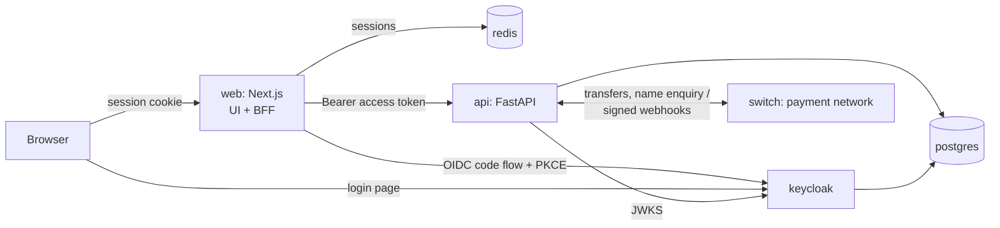

# Scan-to-Confirm

People pay anyone by **bank and account number**, whether the recipient is on the platform or at another bank, and share a **signed QR receipt** instead of a screenshot. Anyone who scans it sees the payment's **live status** from the platform's ledger, and forged, edited, recycled or reversed receipts are caught. The design is in [`system_design.md`](system_design.md).

## Run it

Requirements: Docker Desktop (with Compose).

```bash
cp .env.example .env      # first time only; a ready-to-use .env is already included
docker compose up --build
```

### Configuration

Every setting lives in **`.env`** at the repository root: ports and public URLs, database credentials, Keycloak admin login, realm and client settings, the demo password, sandbox options and the receipt salt. Docker Compose reads it automatically and passes each value to the service that needs it:

| Where it goes | How |
|---|---|
| Postgres, API, web server | Environment variables set in `docker-compose.yml` from `.env` |
| Keycloak realm (client secret, redirect URLs, audience, demo passwords) | `${…}` placeholders in `infra/keycloak/realm-scan-to-confirm.json`, filled when the realm is first imported |
| Browser bundle (`NEXT_PUBLIC_*`) | Build arguments for the web image |

`.env.example` documents every variable and marks the ones to change outside local development. `.env` itself is git-ignored.

Changes to most values apply with `docker compose up -d --build`. Two exceptions only apply to fresh data:
- **Keycloak realm settings** are imported once. After changing them, run `docker compose down -v` (this wipes all data).
- **Database users and passwords** are also created only on the first start.

The first start takes a few minutes, mostly Keycloak importing its realm. When all six services are healthy (with the default `.env`):

| What | URL |
|---|---|
| **Web app** (landing page) | http://localhost:3000 |
| API docs (Swagger) | http://localhost:8000/docs |
| Keycloak admin console | http://localhost:8080/admin (admin / admin) |
| Sandbox payment network (Swagger) | http://localhost:8100/docs |

Use `localhost`, not `127.0.0.1`. The sign-in redirect and CSRF checks are set up for `http://localhost:3000`.

### Demo accounts

All passwords are `demo1234`. You can also click **Create account** to register a new user, who starts with a $500.00 sandbox balance.

| Username | Role | What to look at |
|---|---|---|
| `sam` | Member | Payer: send money, share receipts. Send $1,000 or more to see the step-up check (code `123456`) |
| `rita` | Member | Payee: verify receipts, confirm "I received it", refund Jordan's "overpayment" |
| `ada` | Member + business | Payee for the edited-receipt scenario |
| `jordan` | Member (flagged) | A new, risky account: large payments are held for review |
| `morgan` | Risk analyst | **Risk console**: held payments, suspicious receipts, disputes, AI case summary |
| `olivia` | Platform finance (ops) | **Platform ledger**: trial balance, every account, the full journal |

To see payer and payee at the same time, sign in as Sam in one browser and Rita in a private window (or another browser).

### Things to try

1. As **Sam**, open **Send money**, choose **Scan-to-Confirm**, enter Rita's account number `2000000022`: her name appears before you send. Send $20, then copy the receipt link or download the receipt image.
2. As **Rita**, open that link (or upload the image on **Verify a receipt**). You'll see VERIFIED, the live status, and what was checked. Click **I received it**; opening the link again now says it was already confirmed.
3. On **Verify a receipt**, use **Try a scenario** to run forged, edited, recycled, reversed and pending receipts. Each one signs you in as the right person.
4. As **Rita**, refund part of Jordan's $500 "overpayment", then use **Simulate reversal** on that payment. Only the part Rita still holds is taken back.
5. As **Olivia**, open **Platform ledger** to see every posting. Payments, holds, refunds and reversals are all balanced journal entries.
6. **Pay another bank.** As Sam, choose **Aurora Bank** and pick Maya Chen from the test accounts panel. Send $20.00 (instant), $5.13 (times out, then succeeds after 30 s), $5.14 (times out, then fails and the money comes back) or $5.66 (succeeds, then Aurora Bank reverses it after 60 s). The payment page updates itself as the network answers.
7. **Receive from another bank.** On the Overview, click **Receive from another bank** to have a test account holder send you money through the network.

### Inter-bank payments

The `switch` service is a sandbox payment network with four fictional banks (Aurora Bank, Harbor Trust Bank, Meridian Bank, Northwind Savings) and test account holders at each. It does what a national instant-payment switch does for real banks: name enquiry, transfers with a session ID, status queries, delayed outcomes and reversals pushed to the platform by HMAC-signed webhook, and a daily settlement report (`GET /v1/settlement?date=YYYY-MM-DD`).

| On the ledger | Debit | Credit |
|---|---|---|
| Send to another bank | Payer | Suspense |
| Network confirms | Suspense | Inter-bank network settlement |
| Network fails it | Suspense | Payer (money back) |
| Other bank reverses it | Network settlement | Payer (money back) |
| Money arrives from another bank | Network settlement | Payee |

A timeout never fails a payment: it stays **pending** until a webhook arrives, or until the API's background job asks the network (status query) and settles it either way. Receipts for inter-bank payments say what the platform can actually vouch for: that the payment network confirmed delivery to the recipient's bank.

## Architecture



| Service | Role |
|---|---|
| `web` | Next.js 16 UI (Redux Toolkit, Tailwind). Its server is the **backend-for-frontend**: it runs the Keycloak sign-in, keeps tokens in Redis, and proxies `/api/v1/*` to the API with the user's access token. The browser only ever holds an opaque httpOnly cookie. |
| `api` | FastAPI + SQLAlchemy. Verifies every Keycloak access token (signature via JWKS, issuer, audience, expiry). Owns the double-entry ledger, transfers, signed receipts (Ed25519), verification, risk rules, cases and ledger reports. Alembic migrations run on start. |
| `switch` | Sandbox inter-bank payment network (FastAPI + SQLite): banks, name enquiry, transfers, status queries, signed webhooks, settlement report. |
| `keycloak` | Identity provider (OIDC). Realm, clients, roles and demo users are imported from `infra/keycloak/`. Self-registration is on. |
| `postgres` | App database (`scan`) and Keycloak's database (`keycloak`). Ledger tables are append-only at the database level (trigger). |
| `redis` | Web sessions and short-lived sign-in state. |

## Tests

```bash
# API unit tests (no database needed)
docker compose run --rm --no-deps --entrypoint "python -m pytest -q" api

# End-to-end, with the stack running
node services/api/tests/smoke_interbank.mjs  # Inter-bank: name enquiry, all network outcomes, inbound, webhooks (~90 s)
node services/api/tests/smoke_api.mjs        # API: auth, scenarios, payments, refunds, roles, ledger
node web/scripts/smoke-login.mjs             # Browser sign-in via Keycloak, BFF proxy, CSRF, sign-out
```

`smoke_interbank.mjs` creates its own throwaway users and leaves existing data alone. The other two **reset the demo data** (as Olivia) when they finish, which removes any payments you've made.

## Reset

- Demo data only: sign in as **olivia**, open **Verify a receipt**, click **Reset demo data**. Keycloak users are kept.
- Everything, including Keycloak and database volumes: `docker compose down -v`

## Repository layout

```text
docker-compose.yml       The whole stack (all settings come from .env)
.env.example             Every configuration variable, documented
infra/keycloak/          Realm import: clients, roles, demo users
infra/postgres/init/     Creates Keycloak's database
services/api/            FastAPI service (see app/services for the domain logic)
services/switch/         Sandbox inter-bank payment network
web/                     Next.js app (see web/README.md)
system_design.md         System design and milestones
```

## Not production-ready yet

- The receipt signing key's private half is stored in Postgres. Production uses a KMS (§13).
- The `scan-cli` Keycloak client allows password login for tests only. Disable it in production.
- The AI services (receipt vision, risk model, copilot) are rule- and template-based stand-ins until milestones M5–M7. The UI says so where it matters.
- The values in `.env.example` are development defaults. Replace everything marked CHANGE before deploying anywhere shared.
