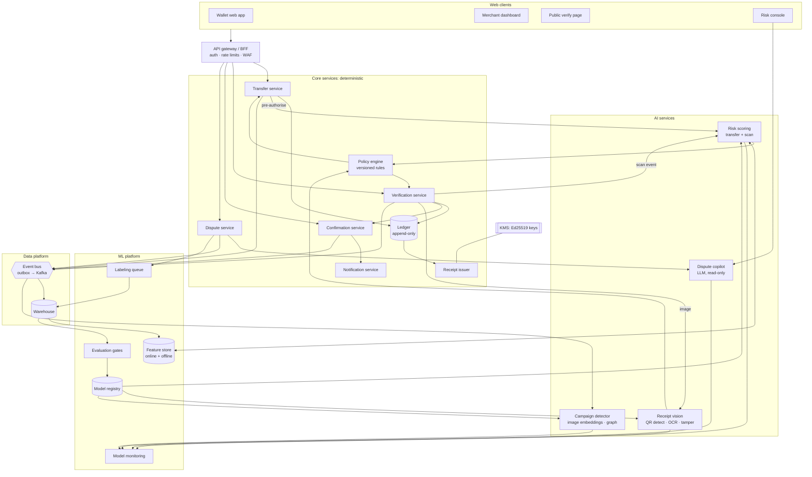
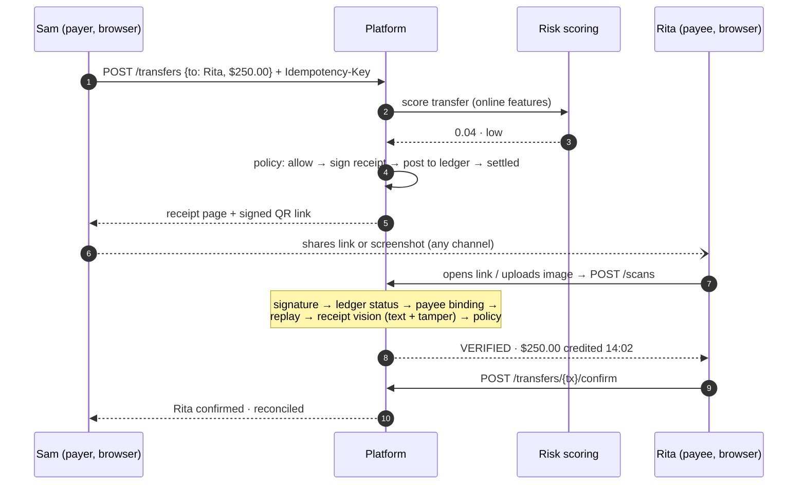
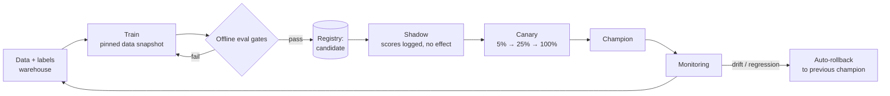
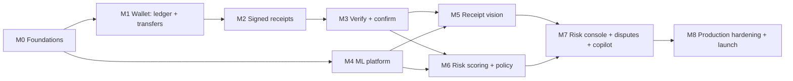

# Scan-to-Confirm: AI-Assisted Transfer Verification

| | |
|---|---|
| **Status** | Draft v3.1 |
| **Date** | 2026-09-26 |
| **Author** | Damilare |
| **Scope** | Web platform where users on the same payment platform send money, share signed QR receipts, and verify them. Verification combines deterministic checks with production AI services. |

---

## 1. Problem

Users of one payment platform pay each other, and the payee can be anyone on the platform: a friend splitting a bill, a landlord, a seller on a marketplace, or a small shop. The payer usually proves payment by sharing a receipt screenshot, and the payee has to decide whether to trust it.

Fraudsters take advantage of this with:

- **Forged receipts:** a fake "payment successful" screen for a transfer that never happened.
- **Edited receipts:** a genuine receipt with the amount changed.
- **Recycled receipts:** an old genuine receipt shown again as if it were a new payment.
- **Pay-then-reverse:** a real transfer from a compromised or mule account that is reversed later.
- **Overpayment scams:** "I sent you too much by mistake, please send back the difference." Either the receipt is edited to show a bigger amount, or the scammer really pays from a stolen source, collects the "refund", and the original payment is then reversed.

Since sender and recipient are on the same platform, **the platform's ledger knows the truth about every transfer.** The job of this system is to bring that truth to whoever is looking at a receipt, and to use AI to spot abuse that single deterministic checks miss.

## 2. Goals and non-goals

**Goals**

1. Anyone holding a receipt can verify it in a browser, either by pointing any phone camera at the QR or by uploading the image. No app install is needed.
2. Verification is exact for authenticity and settlement, because it comes from the signature and the ledger.
3. AI services detect tampered images, risky transfers and coordinated forgery campaigns, and help analysts resolve disputes faster.
4. Every transfer closes with a two-party confirmation record.
5. Money sent back to a payer travels as a refund linked to the original payment, so a later reversal of that payment cannot leave the payee out of pocket.
6. The AI parts run to production standard: versioned models, evaluation gates, shadow and canary rollout, monitoring, rollback, and human review of high-impact decisions.

**Non-goals (v1)**

- Native mobile apps. The product is a responsive web app that works in mobile browsers.
- Verifying receipts issued by other banks' own apps. (Payments *to and from* other banks are in scope; see §6.6.)
- Fully automatic account bans. Account-level actions always require an analyst.

## 3. Design principles

1. **The ledger is the source of truth.** A receipt image is a claim. Authenticity comes from the signature and settlement comes from the ledger.
2. **AI can only add caution.** Models can flag, hold or require step-up authentication. They can never turn a failed deterministic check into a pass.
3. **The system degrades safely.** If an AI service is slow or down, verification still returns the deterministic verdict, marked "visual check unavailable". AI outages never block payments or verification.
4. **High-impact actions need a human.** Freezing an account, reversing a transfer or closing a dispute against a user requires an analyst's decision. The AI supplies evidence and recommendations.
5. **Every AI decision is traceable.** Each output is stored with its model version, feature snapshot, score and reason codes.
6. **Text inside images is untrusted.** OCR text can contain instructions aimed at the LLM ("ignore previous instructions…"). It is always passed as data, and LLMs have no tools that change state.
7. **The QR carries little personal data,** and full details are shown only to the parties after login.
8. **Money is stored in integer minor units.** The ledger is append-only.

## 4. Users and web surfaces

| User | Web surface | Main tasks |
|---|---|---|
| **Payer** | Wallet web app | Send money, view and share the receipt (link, image or QR), see when the recipient confirms. |
| **Payee** (any user) | Wallet web app | See incoming transfers, verify a receipt, confirm "I received it", refund a payment. |
| **Merchant owner / cashier** (optional) | Merchant dashboard | For payees who run a shop: cashiers verify customers' receipts at the counter without access to the owner's balance. Owners see every confirmed payment. |
| **Anyone with a receipt** | Public verify page | Check that a receipt is genuine, its amount, date and current status. No names and no confirm button. Every check still runs. |
| **Risk / support analyst** | Risk console | Review holds and disputes, read AI case summaries, label outcomes. |
| **ML engineer** | ML platform | Train, evaluate, ship and monitor models. |

**Receipt QR codes are links.** The QR encodes `https://pay.example/r#RCPT1.<payload>.<sig>`. Any phone camera opens the public verify page in the browser. The signed token sits in the URL **fragment**, so it is never sent in the HTTP request line or written to server or proxy logs. The page reads it and posts it to the API. Logged-in parties get the full view and the confirm button.

The verify page can also decode a QR from the webcam (`BarcodeDetector` where available, zxing-js otherwise) or from an uploaded image.

## 5. Architecture

### 5.1 Component diagram



### 5.2 Core services (deterministic)

| Service | Responsibility |
|---|---|
| **API gateway / BFF** | Session auth (OIDC), CSRF protection, rate limits per user and IP, WAF, request IDs. |
| **Transfer service** | Create transfers with idempotency keys. Calls risk scoring before authorising. Tracks status: `initiated → pending → settled`, or `held`, `failed`, `reversed`. Handles refunds (§6.5). |
| **Ledger** | Double-entry, append-only journal where debits equal credits for each transfer. |
| **Receipt issuer** | Build and sign the payload through KMS **when the transfer is created**, render the receipt image, publish public keys (JWKS). The QR only points to the transfer, so a receipt for a pending or held transfer is valid and shows its live status. |
| **Verification service** | Run the check pipeline (§7), call receipt vision, and return the verdict with reason codes. |
| **Confirmation service** | Record one confirmation per transfer and notify the payer. |
| **Policy engine** | Turn deterministic results and model scores into actions (allow, step-up, hold, flag). Rules are versioned, reviewed in code, and each has an ID. |
| **Dispute service** | Case management, evidence bundle, analyst decisions, and outcome labels fed back to ML. |
| **Notification service** | In-app, email and web-push notifications. Sends reversal alerts after confirmation. |

### 5.3 AI services

| Service | Task | Model (v1) | Input | Output | p95 latency budget | If unavailable |
|---|---|---|---|---|---|---|
| **Receipt vision** | Find and decode QR codes in hard images (photos of screens, crops). Read the printed amount and `tx`. Detect and localise edits. | YOLO-style QR detector + zxing. PaddleOCR (ONNX). Image-manipulation segmentation CNN. | Receipt image | QR payload, OCR fields with confidence, tamper score + heatmap | 800 ms | Deterministic verdict only, marked "visual check unavailable" |
| **Risk scoring** | Score transfers at authorisation (account takeover, mule accounts, scam payments) and scan events (forged-receipt attempts). | Gradient-boosted trees (LightGBM), calibrated, with SHAP reason codes | Online features from the feature store | Score 0–1, risk band, top reasons | 60 ms | Fall back to policy rules (velocity limits, new-account limits) |
| **Campaign detector** | Group forged receipts that reuse a template or image, and link the accounts and devices behind them. | Perceptual hash + image embeddings (CLIP-class) with nearest-neighbour search, plus graph features over account–device–IP links | Suspicious scan images, account graph | Cluster IDs, campaign alerts | async (minutes) | Alerts delayed; nothing user-facing is blocked |
| **Dispute copilot** | Summarise a case for the analyst with citations, suggest a resolution, draft the user message. | Hosted LLM (e.g. on Groq) with JSON-schema output | Evidence bundle (records, OCR text as data, scores) | Summary with cited record IDs, suggested outcome, draft reply | 5 s, async | Analyst works from the raw evidence view |

## 6. Key flows

### 6.1 Send, share, verify, confirm



### 6.2 Risky transfer: step-up and hold

1. The risk score falls in the **medium** band, for example a new device plus an unusual amount to a new payee. The policy engine requires step-up authentication (passkey or OTP) before authorising.
2. In the **high** band, the transfer is `held`. Funds are reserved but not credited. A case opens in the risk console with the SHAP reasons and a copilot summary.
3. The analyst releases or cancels the transfer. Their decision becomes a training label.

### 6.3 Forged receipt attempt

1. Someone uploads a receipt whose signature fails, or whose printed amount differs from the signed amount.
2. The verdict is `SUSPICIOUS` with reason codes. The payee sees "Don't treat this as paid" and the actual transfer, if one exists.
3. The scan event goes to risk scoring and the campaign detector. If the image matches a known forgery cluster, the linked sender accounts are flagged for analyst review.

### 6.4 Reversal after confirmation

A reversal marks the transfer `reversed`. Both parties are notified, later scans return `SUSPICIOUS (reversed)`, and a dispute opens automatically.

### 6.5 Overpayment claims and refunds

The scam has two forms, and the design handles both.

- **Edited receipt ("I sent $250, you only charged $25"):** the verify page always shows the real amount from the ledger. If an image was uploaded, the payee also sees "The receipt shows $250.00, but the real transfer was $25.00." There is nothing to send back.
- **Real payment from a stolen source, then a request to send back the "extra":**
  1. Every incoming payment has a **Refund** action. A refund is a new transfer with `refund_of = <original tx>`, sent back to the original payer and capped at the amount not yet refunded.
  2. If the original payment is later reversed, the payee is debited only for the part they still hold (original − refunded). The refunded part is recovered from the account that received the refund. If that account can't cover it, the platform holds the loss and a case opens for the analyst, not the payee.
  3. If the payee instead starts a normal transfer to someone who paid them in the last 72 hours, the send page warns: "Sending money back to Sam? Use Refund on their payment so you're protected if it's reversed." Risk scoring also receives this as a feature (`send_back_to_recent_payer`).
  4. A refund request against a payment that is `held`, `pending` or high-risk is blocked with an explanation until the payment settles or an analyst clears it.

### 6.6 Inter-bank transfers

Users pay anyone by **bank + account number**. Every wallet has a 10-digit account number (9 digits + a Luhn check digit), so typos are caught before any lookup. The payer picks the bank, enters the number, and sees the **name on the account** (name enquiry) before sending; the server repeats the enquiry when the payment is created and never trusts a client-supplied name.

- **Same platform:** settles instantly on our ledger, exactly as before.
- **Another bank:** goes through the payment switch. Money moves wallet → suspense on submit; suspense → network settlement account when the network confirms; back to the wallet if the network fails it or the other bank reverses it. Money received from another bank is posted network settlement → wallet.
- **Unknown outcomes:** a timeout never fails a payment. It stays `pending` until the switch's signed webhook arrives or the API's background status query settles it.
- **Receipts:** an inter-bank receipt binds the payee as `<bank>:<account number>` (hashed). Verification says what we can vouch for: the network confirmed delivery to the recipient's bank, not that their bank's ledger was credited.
- **Limits in v1:** refunds of payments received from other banks aren't supported; the sandbox rail tools (settle, reverse) don't apply to network payments, whose outcomes come from the network.

The sandbox network (`services/switch`) has four fictional banks with test account holders, and amounts ending in .13, .14 and .66 trigger timeout-then-success, timeout-then-failure, and success-then-reversal. Its daily settlement report is the input for settlement reconciliation (a planned next step).

## 7. Verification logic

### 7.1 Verdicts

| Verdict | Meaning | Payee sees |
|---|---|---|
| `VERIFIED` | Valid signature, settled, correct payee, not previously confirmed, and no visual or risk flags. | "$250.00 from Sam arrived on 26 Sep at 14:02. Payment received." |
| `PENDING` | Genuine receipt, but the transfer is still pending or held. | "Payment not yet received. We'll notify you." |
| `SUSPICIOUS` | Any check or flag failed. Always includes reason codes. | "Don't treat this as paid," plus the reason and a dispute option. |

**Warnings** appear above the verdict without changing it. They catch situations where the payment is real but is not what the payer is presenting it as:

| Warning | When | Payee sees |
|---|---|---|
| `previously_checked` | The payee has already verified this receipt before, but never confirmed it | "You already checked this payment on 12 Sep at 09:14. It is not a new payment." |
| `old_receipt` | The transfer is older than a configurable age (default 24 h) | "This payment was made on 12 Sep. Make sure it's for what you're being paid for now." |
| `visual_check_unavailable` | Receipt vision timed out or is down | "We checked the payment, but couldn't check the image." |
| `not_your_payment` | A signed-in user checks a receipt for a payment made to someone else | "This payment was made to Ada's Bakery, not to you." |

A `previously_checked` warning only counts earlier checks by the payee that did not end in `SUSPICIOUS`, because only a check that showed the payment as genuine means it could be reused.

**Every check runs for every viewer.** The viewer's role only decides what is shown and what they can do. The public view shows whether the receipt is genuine, plus its amount, date, status and verdict, without names and without the confirm or refund buttons.

### 7.2 Decision order

Checks run in order. Steps 1–7 are deterministic, and steps 8–9 can only make the verdict stricter.

```text
1. obtain token: URL fragment | webcam decode | image upload
     image upload → receipt vision: QR detect + decode
     no QR found  → SUSPICIOUS(no_qr)
2. parse payload; look up kid          unknown / revoked → SUSPICIOUS(bad_signature)
3. verify Ed25519 signature            invalid           → SUSPICIOUS(bad_signature)
4. load transfer by tx                 not found         → SUSPICIOUS(unknown_transfer)
                                       payload ≠ record  → SUSPICIOUS(payload_mismatch)
5. viewer role (decides what is shown, not which checks run)
     payee or authorised cashier → full view, may confirm and refund
     payer                       → full view
     anyone else                 → public view
6. transfer status                     failed | reversed → SUSPICIOUS(reversed)
                                       pending | held    → PENDING
7. replay
     already confirmed                  → SUSPICIOUS(already_confirmed, confirmed_at)
     payee checked this receipt before  → warning previously_checked(first_checked_at)
     transfer older than max age        → warning old_receipt(created_at)
8. receipt vision (whenever an image was submitted)
     OCR amount conf ≥ 0.95 and amount ≠ payload amount → SUSPICIOUS(text_mismatch)
     tamper score ≥ τ_tamper (set per model version)     → SUSPICIOUS(edited_image)
     service unavailable → continue, warning visual_check_unavailable
9. policy engine on scan-risk score + campaign match
     high → SUSPICIOUS(risk_flag) and open a case
10. otherwise → VERIFIED
```

Thresholds such as `τ_tamper` are stored with the model version in the registry. The evaluation gates (§11) set them to meet the false-alarm budget.

### 7.3 How each fraud is caught

| Fraud | Caught by | What the payee sees |
|---|---|---|
| Forged receipt | Signature check (step 3) | `SUSPICIOUS`: "This is not a valid receipt." |
| Edited receipt | Receipt vision: printed amount vs signed amount, tamper model (step 8) | `SUSPICIOUS`: "The receipt shows $250.00, but the real transfer was $25.00." |
| Recycled receipt, previously confirmed | Replay check (step 7) | `SUSPICIOUS`: "Already confirmed on 12 Sep." |
| Recycled receipt, never confirmed | Replay check (step 7) | Warnings `previously_checked` and/or `old_receipt`, with the original date |
| Receipt for someone else | Payee binding (step 5) | Public view only, with no confirm button |
| Pay then reverse | Risk scoring at send time (§6.2); live status on every scan (step 6); reversal alerts (§6.4) | `SUSPICIOUS (reversed)`, or `PENDING` while held |
| Overpayment scam | Real amount always shown; refunds linked to the original payment (§6.5) | The true amount, and the refund protection |
| Forgery campaign | Campaign detector (§5.3) | Handled by analysts; linked accounts flagged |

## 8. Receipt format

```text
https://pay.example/r#RCPT1.<base64url(payload)>.<base64url(Ed25519 signature)>
```

| Field | Type | Purpose |
|---|---|---|
| `v` | int | Format version. |
| `tx` | string | Transaction ID (unguessable, 128-bit). |
| `amt` | int | Amount in minor units (`25000` = $250.00). |
| `ccy` | string | ISO 4217 code. |
| `to` | string | `h:` + salted SHA-256 of the payee account ID. |
| `ts` | string | Issue time, RFC 3339 UTC. |
| `kid` | string | Signing key ID. |

The receipt is signed when the transfer is created, and its content never changes. Status is never in the QR; it always comes live from the ledger. The signature covers canonical JSON with sorted keys. The token is about 300 characters, so use QR error-correction level M. The receipt image also prints the amount, date, masked names and `tx`, which is what the OCR tamper check reads.

## 9. Data model

```text
-- core
users              (id, display_name, email, created_at, kyc_level)
accounts           (id, user_id, account_number UNIQUE, currency, status active|frozen, created_at)
merchant_staff     (merchant_user_id, staff_user_id, role owner|cashier)
transfers          (id tx_…, kind payment|refund, refund_of NULL → transfers.id,
                    sender_account_id, recipient_account_id, amount_minor, currency,
                    refunded_minor DEFAULT 0, status, idempotency_key UNIQUE, risk_decision_id,
                    created_at, settled_at, reversed_at)
                    -- CHECK: a refund's amount ≤ original.amount_minor − original.refunded_minor
ledger_entries     (id, transfer_id, account_id, direction DR|CR, amount_minor, created_at)   -- append-only
signing_keys       (kid, public_key, status, created_at, retired_at)
receipts           (id, transfer_id UNIQUE, payload_json, signature, kid, issued_at)
scans              (id, viewer_user_id NULL, source link|webcam|upload, image_sha256 NULL, image_uri NULL,
                    receipt_id NULL, verdict, reasons TEXT[], vision_inference_id NULL,
                    risk_decision_id NULL, created_at)
confirmations      (id, transfer_id UNIQUE, confirmed_by, scan_id, confirmed_at)
disputes           (id, transfer_id NULL, scan_id NULL, opened_by, reason, status,
                    resolution, resolved_by, resolved_at)

-- AI decisions (one row per model call, immutable)
inference_log      (id, service, model_name, model_version, input_ref, features_ref,
                    output JSONB, score, latency_ms, created_at)
risk_decisions     (id, subject transfer|scan, subject_id, score, band, reasons JSONB,
                    policy_rule_id, action allow|step_up|hold|flag, inference_id, created_at)
labels             (id, subject, subject_id, label, source analyst|dispute|chargeback|synthetic,
                    labeled_by, created_at)
campaigns          (id, first_seen, status, member_scan_ids[], linked_account_ids[])
```

An index on `scans (receipt_id, viewer_user_id, created_at)` answers "has this payee checked this receipt before?" for the `previously_checked` warning.

The link from `inference_log` to `features_ref` (a feature-store snapshot key) makes every score reproducible for audits and debugging.

## 10. API

| Method | Path | Purpose |
|---|---|---|
| `POST` | `/v1/transfers` | Create a transfer (`Idempotency-Key` required). Runs a risk check and may return `step_up_required`. |
| `POST` | `/v1/transfers/{tx}/step-up` | Complete step-up authentication. |
| `GET` | `/v1/transfers/{tx}` | Details (parties only). |
| `GET` | `/v1/transfers/{tx}/receipt` | Signed token, QR link and rendered PNG. |
| `POST` | `/v1/scans` | Verify a token or image; returns verdict, reasons and view level. |
| `POST` | `/v1/transfers/{tx}/confirm` | Payee or cashier confirms, once. |
| `POST` | `/v1/transfers/{tx}/refund` | Payee refunds all or part of a payment to its payer (`Idempotency-Key` required; capped at the unrefunded amount). |
| `POST` | `/v1/disputes` | Open a dispute. |
| `GET` | `/v1/cases/{id}` | Analyst: evidence bundle + copilot summary. |
| `POST` | `/v1/cases/{id}/decision` | Analyst decision; writes a label. |
| `GET` | `/.well-known/receipt-keys.json` | Public signing keys (JWKS). |

Example response from `POST /v1/scans` for an edited receipt:

```json
{
  "scan_id": "scn_01J9…",
  "verdict": "SUSPICIOUS",
  "reasons": ["text_mismatch"],
  "warnings": [],
  "view": "party",
  "transfer": { "tx": "tx_7F3K9QX2", "amount_minor": 2500, "currency": "USD", "status": "settled" },
  "checks": {
    "signature": "pass", "status": "settled", "payee": "match", "replay": "none",
    "vision": { "model": "receipt-vision@1.4.0", "printed_amount": "250.00",
                "ocr_confidence": 0.99, "tamper_score": 0.91 }
  },
  "message": "The receipt shows $250.00, but the real transfer was $25.00."
}
```

## 11. Production ML lifecycle

### 11.1 Model lifecycle



| Stage | What happens | Gate to move on |
|---|---|---|
| **Train** | Reproducible pipeline on a pinned warehouse snapshot. Code, data hash and parameters are logged (MLflow). | — |
| **Offline eval** | Held-out set split by time, never a random split, plus fixed "golden" regression sets per fraud type. | Metrics in §11.3 at least as good as the champion's, with no regression on any fraud type beyond tolerance. |
| **Shadow** | The candidate scores live traffic alongside the champion. Its outputs are logged and not acted on. | ≥ 7 days; agreement and score distribution reviewed. |
| **Canary** | Share of traffic ramps up with automatic guards on hold rate, false-alarm reports and latency. | Guards stay green at each step. |
| **Champion** | Serves all traffic. The previous champion stays warm for instant rollback. | — |

### 11.2 Labels and feedback

- **Sources:** analyst decisions on holds and cases, dispute outcomes, confirmed reversals and chargebacks, and "this was actually fine" reports from users. A synthetic forgery generator creates vision training data.
- **Cold start:** risk scoring launches as rules in the policy engine. The model runs in shadow until enough labels exist (target ≥ 2,000 labeled positives) and it beats the rules offline.
- **Labeling queue:** a sampled review of low-confidence and disagreeing cases. Some auto-allowed traffic is also sampled at random, to measure missed fraud without only learning from cases that were already flagged.
- **Label delay:** fraud labels can take weeks to arrive (chargebacks). Training windows leave a label-maturity gap, and offline metrics are computed only on matured labels.

### 11.3 Model metrics and targets

| Model | Primary metrics | Target (design goal) |
|---|---|---|
| Receipt vision: QR detect/decode | Decode rate on degraded images | ≥ 98% |
| Receipt vision: OCR amount | Exact-match accuracy | ≥ 99% |
| Receipt vision: tamper | Recall on edited receipts; false alarms on genuine | ≥ 97% recall at ≤ 0.5% false alarms |
| Risk scoring: transfers | Fraud recall at the fixed hold-rate budget; precision of holds; calibration (ECE) | Recall ≥ 80% at ≤ 1% hold rate; ECE ≤ 0.03 |
| Campaign detector | Cluster purity; time from first forgery to alert | ≥ 95% purity; alert ≤ 30 min |
| Dispute copilot | Citation validity; analyst acceptance; hallucinated facts | 100% citations resolve; ≥ 70% accepted; 0 unsupported facts in audited samples |
| **End-to-end** | Forged/edited receipts marked `SUSPICIOUS`; genuine receipts marked `SUSPICIOUS` | ≥ 99.5%; ≤ 0.5% |

### 11.4 Monitoring in production

- **Input drift:** population stability index (PSI) on key features and image statistics. Alert when PSI > 0.2.
- **Output drift:** score distribution, hold rate and `SUSPICIOUS` rate per surface, with alerts on sudden jumps.
- **Quality:** weekly metrics on newly matured labels; calibration curves.
- **Segment fairness:** false-alarm and hold rates by account age, region and merchant category. Protected attributes are never features, and gaps above a set tolerance trigger review.
- **Operations:** latency per model, error rate, fallback rate ("visual check unavailable"), GPU and CPU use, and LLM token cost per case.
- **Alert routing:** on-call engineer for operational problems, ML owner for quality and drift. Every alert has a runbook.

### 11.5 LLM guardrails (dispute copilot)

- **Read-only.** The LLM has no tools and cannot change state. It returns JSON that matches a schema.
- **Untrusted text is fenced.** OCR text and user messages go in delimited data fields and are never treated as instructions. The system prompt says so, and tests include prompt-injection receipts.
- **Citations are checked.** Every factual claim must cite a record ID from the evidence bundle. The server checks that each ID exists and that quoted values match. Failing summaries are discarded and the analyst sees the raw evidence.
- **Personal data is minimised.** Names, emails and account numbers are masked before the call. The provider must have zero data retention by contract.
- **Everything is versioned.** The prompt, model ID and output are stored in `inference_log`, and prompt changes go through the same evaluation gates.

## 12. Non-functional requirements

| Area | Requirement |
|---|---|
| Availability | 99.9% for transfers and the verify API. AI services are soft dependencies with fallbacks. |
| Latency (p95) | Verify with a link token ≤ 300 ms. Verify with image upload ≤ 1.5 s. Risk check adds ≤ 60 ms to a transfer. |
| Throughput | 200 scans/s and 100 transfers/s at launch, scaling horizontally. |
| Data durability | Postgres with point-in-time recovery. RPO ≤ 5 min, RTO ≤ 1 h. |
| Consistency | Ledger writes and outbox events commit in one transaction (outbox pattern). |
| Idempotency | All write endpoints accept an idempotency key. |

## 13. Security and privacy

- **Keys:** Ed25519 keys in a cloud KMS, rotated quarterly. Revoked `kid`s fail verification immediately.
- **Web security:** OIDC sessions with passkeys for step-up, CSRF tokens, strict CSP, SameSite cookies, HSTS, and upload scanning with an image re-encoding step that strips payloads.
- **Access:** row-level authorisation, cashier accounts scoped to verification only, and analyst actions audited.
- **Abuse:** rate limits on `/scans` and on public verification, unguessable `tx` IDs, and bot detection on the public page.
- **Personal data:** receipt images encrypted at rest, with retention limited (e.g. 180 days, or dispute close plus 90 days). Training data is pseudonymised, and access to it is logged.
- **Model security:** signed model artifacts in the registry, pinned dependencies, and inference services with no outbound internet except the LLM provider.

## 14. Tech stack

| Layer | Choice |
|---|---|
| Web front end | Next.js (React, TypeScript), responsive. `BarcodeDetector` / zxing-js for webcam QR. Web push notifications. |
| Backend services | Python 3.12 + FastAPI; Postgres 16; Redis for sessions, rate limits and online features. |
| Events | Transactional outbox → Kafka (or Redpanda). |
| Warehouse | BigQuery, Snowflake or Postgres + DuckDB at small scale. |
| Feature store | Feast (Redis online, warehouse offline). |
| Model training and registry | Python, LightGBM, PyTorch; MLflow tracking and registry. |
| Model serving | ONNX Runtime behind FastAPI or BentoML; GPU only for the tamper model if CPU latency misses its budget. |
| Vector search | pgvector (campaign detector image embeddings). |
| LLM | Hosted LLM API (e.g. Groq) with JSON-schema output. |
| Labeling | Label Studio for vision labels; case decisions come from the risk console. |
| Orchestration | Airflow or Dagster for training and evaluation pipelines. |
| Infrastructure | Containers on Kubernetes (or managed containers); Terraform; GitHub Actions CI/CD. |
| Observability | OpenTelemetry, Prometheus + Grafana, Evidently (or equivalent) for drift reports. |

## 15. Milestones

Each milestone produces working, demonstrable deliverables and counts as done only when its exit criteria pass. Milestones on different branches of the dependency chart can run in parallel.



| Milestone | Headline deliverable |
|---|---|
| M0 Foundations | Running local stack with login, CI and the shared service template |
| M1 Wallet | Two users can pay and refund each other in the browser on a double-entry ledger |
| M2 Signed receipts | Every transfer gets a signed QR receipt, from the moment it is created, that anyone can verify |
| M3 Verify and confirm | Browser verify page and the full send → verify → confirm handshake |
| M4 ML platform | Pipeline that takes any model from training to shadow, canary and rollback |
| M5 Receipt vision | Live service that reads receipt images and catches edited ones |
| M6 Risk scoring | Transfer and scan risk scores that drive step-up and holds |
| M7 Risk console | Analyst console with cases, campaign alerts and the dispute copilot |
| M8 Launch | Monitored, security-reviewed system live for beta and then general users |

### M0: Foundations

**Goal:** a shared base that every later milestone builds on.

**Deliverables**
- Monorepo with a CI pipeline (lint, type checks, tests) running on every pull request.
- `docker compose up` local stack: web app, API, Postgres, Redis.
- Terraform skeleton for staging and production environments.
- Next.js app shell with OIDC login and a logged-in landing page.
- FastAPI service template with database migrations, structured logging, OpenTelemetry tracing, idempotency middleware and a transactional outbox.
- Money type library (integer minor units + currency) with tests.

**Exit criteria:** One command starts the full local stack. A logged-in user sees an empty wallet page, and CI passes on every PR.

### M1: Wallet with ledger and transfers

**Goal:** real transfers between users, recorded correctly.

**Deliverables**
- Ledger service: accounts, append-only double-entry journal, nightly balance check.
- Transfer API (`POST /v1/transfers`, `GET /v1/transfers/{tx}`) with idempotency keys and the full status lifecycle (`pending`, `settled`, `held`, `failed`, `reversed`).
- Refund API (`POST /v1/transfers/{tx}/refund`) linked to the original payment, capped at the unrefunded amount, with reversal netting (§6.5).
- Wallet web pages: balance, send money, transaction history, and a Refund button on incoming payments.
- In-app and email notifications for incoming transfers.
- Sandbox tools: test funding, simulated settlement delay, failure and reversal.
- Property-based test suite for ledger and refund invariants.

**Exit criteria:** Property-based tests show debits always equal credits, retries never post twice, refunds can never exceed the original, and reversing a partly refunded payment debits the payee only for the part they still hold. Two users can pay and refund each other in the browser.

### M2: Signed receipts

**Goal:** every transfer produces a receipt that cannot be forged, from the moment it is created.

**Deliverables**
- Receipt issuer service: payload builder, canonical JSON, Ed25519 signing through a KMS adapter (local key in development), triggered when a transfer is created.
- `/.well-known/receipt-keys.json` JWKS endpoint with key rotation and revocation.
- Receipt web page showing the QR link, a downloadable receipt image and share buttons.
- Receipt image renderer (QR plus printed amount, date, masked names and `tx`).
- Standalone verification script that uses only the public keys.

**Exit criteria:** The standalone script verifies a receipt using only the JWKS. Rotated keys still verify, and revoked keys fail.

### M3: Verify and confirm

**Goal:** anyone holding a receipt gets a trustworthy answer, and both parties close the transfer.

**Deliverables**
- Public verify page that reads the token from the URL fragment, with webcam scanning and image upload.
- Verification API (`POST /v1/scans`) implementing deterministic steps 1–7 of §7.2 for every viewer, with reason codes and warnings (`previously_checked`, `old_receipt`).
- Viewer roles: party view, public view, and optional cashier accounts managed from a merchant dashboard.
- Confirmation API (`POST /v1/transfers/{tx}/confirm`) enforcing one confirmation per transfer.
- Send-back warning on the send page when paying someone who recently paid you (§6.5).
- Notifications to the payer when the payee confirms, and reversal alerts after confirmation.
- `scans` audit records.
- Automated test suite covering forged, recycled (confirmed and unconfirmed), wrong-payee, reversed and pending receipts, public-view checks, and both overpayment-scam forms.

**Exit criteria:** The end-to-end Sam → Rita flow works in the browser on desktop and mobile. The test suite returns the right verdict and reason for every fraud case.

### M4: ML platform foundations

**Goal:** the infrastructure to train, ship and roll back models safely. Runs in parallel with M1–M3.

**Deliverables**
- Event pipeline from the outbox through Kafka into the warehouse.
- Feature store (Feast) with the first feature definitions and a Redis online store.
- MLflow experiment tracking and model registry.
- Model-serving template (ONNX Runtime + FastAPI) that writes every call to `inference_log`.
- Evaluation harness: time-split datasets, golden sets per fraud type, scorecard report and CI gate.
- Synthetic forgery generator: edited digits, swapped QRs, recycled receipts, fabricated templates, and degradation (recompression, cropping, photo of screen).
- Shadow and canary routing, so any model can score live traffic without affecting it and be ramped up or rolled back.

**Exit criteria:** A placeholder model goes through train → evaluate → register → shadow → canary → rollback in staging with no manual steps.

### M5: Receipt vision

**Goal:** catch edited receipts and read images that simple decoders can't.

**Deliverables**
- QR detector model, used as a fallback when zxing fails.
- OCR component that reads the printed amount and `tx`, with a confidence per field.
- Tamper detection model with a heatmap output, and a threshold chosen to meet the false-alarm budget.
- Receipt vision service, deployed and integrated as steps 1 and 8 of §7.2, with timeouts and fallback.
- Evaluation report against the §11.3 vision targets, and a model card.
- Shadow and canary rollout records.

**Exit criteria:** §11.3 vision targets met on the held-out and golden sets. p95 latency for an image scan ≤ 1.5 s. The fallback path has been tested by stopping the service in staging.

### M6: Risk scoring and policy engine

**Goal:** stop risky transfers and forged-receipt attempts before they cause losses.

**Deliverables**
- Policy engine with versioned rules (velocity, new-account and new-payee limits) as the launch baseline.
- Online risk features: account age, device and IP novelty, payee novelty, amount against history, recent `SUSPICIOUS` scans, `send_back_to_recent_payer`.
- Transfer and scan risk models (LightGBM), calibrated, with SHAP reason codes.
- Step-up authentication flow (`POST /v1/transfers/{tx}/step-up`) and `held` transfer handling.
- Shadow report comparing the model with the rules baseline, and a model card.

**Exit criteria:** The risk check adds ≤ 60 ms p95 to transfers. The shadow report shows fraud recall and hold rate against the rules baseline. Every decision can be reproduced from `inference_log` and its feature snapshot.

### M7: Risk console, disputes and dispute copilot

**Goal:** give analysts the tools to resolve cases quickly, and feed their decisions back as training labels.

**Deliverables**
- Risk console web app: holds queue, dispute cases, and an evidence view with tamper heatmaps, ledger records and risk reasons.
- Case decision API that records outcomes as labels.
- Campaign detector: image embeddings in pgvector, clustering and alerts in the console.
- Dispute copilot service with the guardrails in §11.5.
- Prompt-injection test suite and copilot evaluation report.

**Exit criteria:** An analyst resolves a case entirely in the console. All copilot citations resolve on the evaluation set, an audit of 100 cases finds no unsupported facts, and analysts accept ≥ 70% of summaries. Campaign alerts fire within 30 minutes on a replayed forgery campaign.

### M8: Production hardening and launch

**Goal:** a system that is safe to operate with real users.

**Deliverables**
- Monitoring dashboards and alerts from §11.4, with runbooks and an on-call rotation.
- Load test and chaos test reports (including AI-service outages).
- Security review and penetration test report covering the web app, API, KMS and LLM prompt injection, with high-severity findings fixed.
- Model cards for every model: purpose, data, metrics, limits and owner.
- Launch plan and release: internal users, then a beta cohort, then general availability, with canary guards on hold rate and false-alarm reports.

**Exit criteria:** Beta traffic meets the §11.3 end-to-end targets and the §12 latency and availability targets throughout the beta period, with no open high-severity security findings.

## 16. Risks

| Risk | Impact | Mitigation |
|---|---|---|
| Too few fraud labels at launch | Risk model can't be trained | Rules first; model in shadow; random-sample reviews; synthetic data for vision. |
| False alarms on genuine receipts | Payees lose trust and stop verifying | OCR and tamper checks only downgrade at high confidence; false-alarm budget enforced by the evaluation gates; one-tap "this is wrong" reports become labels. |
| Fraudsters adapt | Model accuracy decays | Drift monitoring, campaign detector, regular retraining, golden sets updated with new attack types. |
| LLM hallucination or prompt injection | Analyst misled | Read-only LLM, validated citations, fenced untrusted text, analyst makes the decision. |
| Payees trust screenshots and never verify | Fraud continues | Incoming-transfer notifications in the wallet itself; a "check before you trust a screenshot" prompt when a payee opens a shared receipt image; optional merchant setting that requires a `VERIFIED` scan before marking an order paid. |
| Payee sends money back outside the Refund action | Overpayment scam succeeds | Send-back warning (§6.5), `send_back_to_recent_payer` risk feature, and step-up on high-risk send-backs. |
| AI service outage | Slow or blocked verification | Soft dependency with timeouts; deterministic verdict still returned; fallback rate monitored. |

## 17. Open questions

1. **Payment licence:** does the platform hold funds itself, or through a licensed partner whose ledger we mirror? This affects how "settled" and "reversed" are sourced.
2. **Step-up method:** passkeys only, or also OTP by SMS or email?
3. **Merchant policy:** should merchants be able to require `VERIFIED` before an order is marked paid, and should that be the default?
4. **LLM provider and data residency:** which regions must data stay in? This may rule out some hosted providers.
5. **Launch market:** which market launches first? It determines fraud patterns, regulatory reporting and fairness segments.
