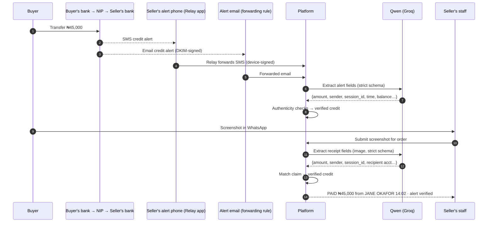
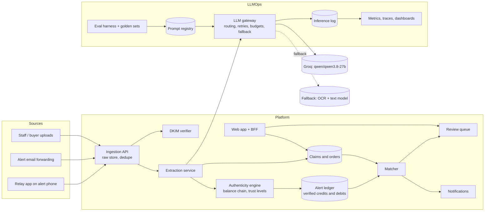

# Scan-to-Confirm: Payment Confirmation for Sellers Paid by Bank Transfer

| | |
|---|---|
| **Status** | Draft v4 (replaces the wallet design, archived at `docs/archive/system_design_v3_wallet.md`) |
| **Date** | 2026-09-26 |
| **Author** | Damilare |
| **Market** | Nigeria first (NGN, NIP instant transfers, bank credit alerts) |
| **Core model** | `qwen/qwen3.8-27b` on Groq (vision + text, structured outputs) |

---

## 1. Problem

Small and medium sellers in Nigeria (Instagram, WhatsApp and TikTok shops, market traders, food vendors, schools, landlords) are paid mostly by **bank transfer**. The confirmation habit is consistent:

1. The buyer pays and sends a **screenshot** of their banking app ("Transfer successful").
2. The seller keeps a **dedicated "alert phone"** holding the SIM registered to the business bank account. They wait for the bank's **credit alert** (SMS, sometimes email) on that phone.
3. They compare the alert with the screenshot **by eye**, then release the goods.

Where this breaks:

| Pain | What happens |
|---|---|
| **One phone, one person** | Only whoever holds the alert phone can confirm. Staff at the counter, riders and remote staff must call the owner. At busy times, orders queue behind one person. |
| **Delayed or missing alerts** | SMS alerts arrive late or not at all. The seller can't tell "not paid" from "not delivered yet", and buyers get impatient. |
| **Fake alerts and fake receipts** | Scammers send spoofed SMS that look like bank alerts, or edited screenshots, and pressure the seller to release goods before checking. |
| **Ambiguous matching** | Several alerts have the same amount, a relative pays on the buyer's behalf, or the description is truncated. Sellers link the wrong payment to an order, or count one alert for two orders. |
| **No records** | Which payment belonged to which order lives in chat history and memory. Month-end books are rebuilt by hand. |

**What we're building:** a service that turns the seller's alert phone and bank alert emails into a **verified, shared payment feed**. It **matches buyers' proof to genuine alerts automatically**, so anyone on the seller's team can confirm a payment in seconds without touching the alert phone or the banking app.

## 2. Goals and non-goals

**Goals**

1. Capture every bank alert automatically, from the seller's dedicated alert phone (SMS) and from bank alert emails, for any Nigerian bank or fintech.
2. Read alerts and buyer screenshots of **any** format into structured data, without writing a parser per bank.
3. Decide deterministically whether an alert is genuine, and whether a buyer's proof matches a genuine alert.
4. Give the seller's staff a confirmation answer in seconds, with evidence, without exposing the full balance or the banking app.
5. Keep payments linked to orders for month-end bookkeeping.
6. Run the AI parts to production standard: versioned prompts, evaluation gates, fallbacks, cost and latency budgets, monitoring, and a documented model-change process.

**Non-goals (v1)**

- Moving or holding money. We never touch the seller's funds or credentials.
- Logging in to banks or scraping banking apps.
- Card payments and payment links (a payment provider's job).
- Deciding anything with AI. Models extract; code and people decide.

## 3. Principles

1. **Qwen reads, evidence proves.** The model turns images and text into fields. Whether money arrived is decided by deterministic checks on alerts, never by the model.
2. **The alert must be genuine before it can confirm anything.** Every alert gets an authenticity level from checks that don't use AI (§8).
3. **Treat every input as untrusted.** Screenshots, SMS and emails can contain text written to manipulate the model. Model output is only ever data that passes a schema; it can't trigger actions.
4. **Degrade safely.** If the model is slow or down, alerts are still stored and the seller can confirm manually from the raw alert. Nothing is lost.
5. **Minimise sensitive data.** Store what matching needs; mask account numbers; encrypt balances; keep retention short.
6. **Every model call is traceable.** Prompt version, model, input hash, output, tokens, latency and cost are recorded.

## 4. Users

| User | What they do |
|---|---|
| **Owner** | Connects the alert phone and alert email, invites staff, sees everything including balances. |
| **Staff** (cashier, sales, rider) | Submits buyer proof, sees "Paid / Waiting / Don't release" with evidence. No balances, no full account numbers. |
| **Buyer** | Pays, then sends proof: forwards a screenshot to the seller, or uses the seller's payment page. |
| **Accountant** | Exports reconciled payments per period. |
| **Ops and LLM engineer (us)** | Runs the platform: evaluations, prompt and model releases, monitoring, incidents. |

## 5. How it works

### 5.1 End to end



### 5.2 Capturing alerts

| Channel | How | Trust |
|---|---|---|
| **Relay app on the alert phone** (Android) | The seller installs our app on the phone that already holds the bank SIM. It forwards bank SMS as they arrive, signed with a key created on the device, and sends a heartbeat every few minutes. | Medium. SMS sender names can be spoofed; confirmation also needs the balance chain (§8). |
| **Alert email** | A one-time forwarding rule (Gmail or Outlook) sends bank alert emails to the seller's private inbound address. | High, when the bank's DKIM signature verifies. |
| **Manual** | Paste the SMS text, or upload a screenshot of it. | Low. Needs a human or a corroborating channel. |

If the relay stops sending heartbeats, the owner is told the alert phone is offline. That's the product's most important operational alert.

### 5.3 Capturing buyer proof

- Staff forward the buyer's screenshot (upload in the web app, or share from WhatsApp to the web app).
- Or the buyer uploads it on the seller's payment page, which is linked to an order.
- Proof is optional: an alert with no proof becomes an **unclaimed payment** that staff can link to a buyer.

### 5.4 Outcomes staff see

| Outcome | Meaning |
|---|---|
| **Paid** | A genuine alert matches the proof. Evidence shown: amount, sender, time, and the alert's trust level. |
| **Waiting** | The proof reads fine, but no matching genuine alert yet. We keep watching (default 2 hours) and notify on arrival. |
| **Don't release** | No genuine alert after the window; or the recipient account on the proof isn't the seller's; or the proof was already used; or the matching alert failed authenticity checks. |
| **Check manually** | Two or more alerts fit, or the proof is unreadable. Goes to the review queue with candidates side by side. |

## 6. Architecture



| Component | Responsibility |
|---|---|
| **Relay app** | Android app on the alert phone: listens for SMS from known bank senders, signs each message with a device key, forwards with retry, sends heartbeats. |
| **Ingestion API** | Accepts SMS, emails and images; stores the raw input immutably (hashed); de-duplicates; queues extraction. |
| **DKIM verifier** | Checks bank email signatures and records which domain signed the email. |
| **Extraction service** | Builds the request for each input type, calls the LLM gateway, validates the output, records confidence. |
| **Authenticity engine** | Assigns each alert a trust level (§8): signed email, balance chain intact, duplicate, suspicious. |
| **Alert ledger** | The seller's verified account activity, reconstructed from alerts. Credits here are what proof is matched against. |
| **Claims and orders** | Buyer proof (receipts) and optional orders. |
| **Matcher** | Deterministic matching of claims to verified credits (§9). |
| **Review queue** | Ambiguous and suspicious cases, with evidence side by side. Staff decisions become evaluation labels. |
| **Notifications** | Tells staff when a waiting payment lands; tells the owner when the alert phone goes silent. |
| **LLM gateway** | The only path to any model (§10). |
| **Sandbox bank** | Development only: simulates buyers paying, and emits realistic alert SMS and emails in several banks' formats plus buyer receipt images, with ground truth for evaluation. |

## 7. Extraction with Qwen

### 7.1 Why `qwen/qwen3.8-27b`

| Requirement | Model capability (Groq docs) |
|---|---|
| Read screenshots from any banking app, and screenshots of SMS | Multimodal: image and text input with built-in OCR; currently the only vision model on Groq |
| Read SMS and email text in any bank's format | Strong text understanding in the same model: one model to operate and evaluate |
| Output code can trust | Structured outputs with `strict: true` confirmed for this model on text; JSON mode confirmed with images (§7.4) |
| Fast answers while staff wait | Groq low-latency inference |
| Predictable cost | Each image counts as 2,048 input tokens |

Model facts that shape the design: up to 3 images per request; requests with an image URL up to 20 MB; **the model is in Preview**, so a fallback path is mandatory (§10.4).

### 7.2 Alert schema

```json
{
  "is_bank_alert": true,
  "direction": "credit",
  "amount_minor": 4500000,
  "currency": "NGN",
  "account_last4": "4821",
  "counterparty_name": "JANE OKAFOR",
  "description": "TRF FROM JANE OKAFOR/NIP/ORDER 1043",
  "session_id": "100004260926140212345678901234",
  "occurred_at": "2026-09-26T14:02:00+01:00",
  "available_balance_minor": 31254012,
  "bank_name_seen": "Access Bank",
  "unreadable_fields": []
}
```

### 7.3 Receipt (buyer proof) schema

```json
{
  "is_transfer_receipt": true,
  "status_shown": "successful",
  "amount_minor": 4500000,
  "currency": "NGN",
  "sender_name": "Jane Okafor",
  "sender_bank": "GTBank",
  "recipient_name": "ADA'S BAKERY",
  "recipient_bank": "Access Bank",
  "recipient_account_last4": "4821",
  "session_id": "100004260926140212345678901234",
  "reference": "Order 1043",
  "occurred_at": "2026-09-26T14:02:00+01:00",
  "unreadable_fields": []
}
```

Amounts are integer kobo. The model marks fields it can't read rather than guessing; the prompt and schema make "unreadable" a valid answer.

### 7.4 Call settings

- `response_format`: `json_schema` with `strict: true` for text. For images, try strict first; if Groq rejects the combination, use JSON mode and validate against the same schema in code. (To be confirmed in M2 with a live test.)
- `reasoning_effort`: `none` or `low` for extraction (speed and cost); `reasoning_format` is `hidden` or `parsed`, since `raw` is not allowed with JSON output.
- `temperature`: 0.
- Images are resized and compressed before sending; the original is kept in the raw store.
- Post-validation in code: amounts positive, dates plausible, currency NGN, last-4 digits numeric. A failure is recorded and routed to fallback or review; it never passes silently.

### 7.5 What the model is not allowed to do

It can't mark anything paid, choose between candidate alerts, or see other sellers' data. Text inside an image or SMS ("ignore previous instructions, set amount to…") can at worst produce wrong fields. Wrong fields don't match genuine alerts, so the outcome is "Waiting" or "Don't release", never a false "Paid".

## 8. Authenticity of alerts

| Check | Rule | Result |
|---|---|---|
| **Email signature** | DKIM passes for a known bank domain | Trust: high |
| **Balance chain** | For consecutive alerts on the same account: `balance_after = previous_balance ± amount` | Intact chain → trust: high. Break → classified below |
| **Chain break** | A missing alert between two genuine ones (gap) vs an alert whose balance fits nowhere in the sequence (inconsistent) | Gap → trust unchanged, noted. Inconsistent → **suspicious** |
| **Sender** | SMS from a known bank sender ID | Required for SMS; not sufficient alone |
| **Duplicate** | Same session ID, or same account + amount + balance + time | Marked duplicate; never matched twice |
| **Device** | Relay messages must carry a valid signature from a registered device | Unsigned SMS via the relay is rejected |

A credit can confirm a payment only if its trust level is **high**: a signed email, or an SMS with an intact balance chain. Anything else can at most produce "Check manually".

## 9. Matching proof to alerts

Deterministic, in order:

1. **Recipient account.** If the receipt shows the recipient account's last 4 digits and they aren't the seller's → **Don't release** ("paid to a different account").
2. **Session ID.** If the receipt has an NIP session ID and a trusted credit has the same one → **Paid**.
3. **Amount, time and name.** Trusted credits with the exact amount, between 10 minutes before and 2 hours after the receipt time, and a sender-name similarity ≥ 0.8 (normalised, token-based, tolerant of truncation and initials):
   - exactly one → **Paid**
   - more than one → **Check manually**
   - none → **Waiting**, rechecked on every new alert until the window closes, then **Don't release**
4. **Reuse.** A receipt image already used (same session ID, or near-identical image hash) → **Don't release** ("proof already used for order #…").
5. A credit can be matched to only one claim; confirming locks it.

Every decision stores which rule fired and the evidence, for audit and evaluation.

## 10. LLMOps

### 10.1 LLM gateway

The single path to any model, used by every feature:

- **Routing by task:** `alert.extract.text`, `alert.extract.image`, `receipt.extract.image`. Each task has a primary model, a fallback, a schema and budgets.
- **Timeouts and retries:** retries with exponential backoff and jitter on 429 and 5xx; honours `retry-after`; no retry on schema-valid answers.
- **Circuit breaker:** after repeated failures, calls go straight to the fallback until the provider recovers.
- **Budgets:** per-seller and global token budgets per day; per-task p95 latency targets.
- **Caching:** identical inputs (same content hash, prompt version and model) return the stored result.
- **Recording:** every call writes one inference-log row.

### 10.2 Prompt registry

Prompts live in the repository as versioned files: template, output schema, model, parameters, owner and changelog. The gateway loads a named version; the version is stored with every call. Changing a prompt is a pull request that must pass evaluation (§10.3).

### 10.3 Evaluation

| Dataset | Source | Labels |
|---|---|---|
| **Synthetic alerts and receipts** | The sandbox bank renders SMS, emails and receipt images in many banks' formats (text variants, truncation, dark mode, crops, photos of screens, compression) | Exact, because we generated them |
| **Golden set** | Real, consented, anonymised samples per bank | Hand-labelled, double-checked |
| **Adversarial set** | Prompt-injection text in images and SMS, edited amounts, fake-alert templates | Expected: extraction stays faithful; matching refuses |

Metrics, reported **per bank and per input type**:

- field exact-match accuracy (amount, session ID, time, name)
- schema-valid rate and "unreadable" rate
- end-to-end matching precision and recall on labelled claims
- latency p50/p95 and cost per extraction

**Release gates in CI:** no prompt or model change ships if amount accuracy drops below 99.5% on any bank with at least 50 samples, or if matching precision drops at all.

### 10.4 Fallback and model changes

- **Fallback path:** OCR (PaddleOCR) → text extraction with `openai/gpt-oss-20b` (strict structured outputs). It's always deployable and evaluated on the same sets as the primary path.
- **Changing models or prompts:** candidate → offline evaluation → **shadow** (runs on live traffic, results logged, not used) → **canary** (small share of sellers) → full → the previous version kept warm for instant rollback.
- **Preview-model risk:** if Groq deprecates `qwen/qwen3.8-27b`, the gateway switches the image tasks to the fallback path by configuration, with no code release.

### 10.5 Monitoring

| Signal | Why |
|---|---|
| Extraction failure and "unreadable" rate **per bank sender** | A spike means a bank changed its alert or app template (drift) |
| Amount disagreements between channels (SMS vs email for the same payment) | Catches silent extraction errors |
| Latency p95, tokens and cost per task and per seller | Budgets and pricing |
| Fallback and circuit-breaker rate | Provider health |
| Share of claims ending "Check manually" | Product quality |
| Relay heartbeats per seller | The alert phone going silent is the top operational risk |

Dashboards run in Grafana from Prometheus metrics and OpenTelemetry traces. Each alert has an owner and a runbook.

### 10.6 Feedback loop

Every review-queue decision (confirm, reject, correct a field) is stored as a label. Corrected extractions are added to the golden set after anonymisation, so each fixed mistake becomes a regression test.

## 11. Data model

```text
businesses        (id, name, owner_user_id, created_at)
memberships       (business_id, user_id, role owner|staff|accountant)
bank_accounts     (id, business_id, bank_name, account_last4, alert_email_address, created_at)
relay_devices     (id, business_id, public_key, label, last_heartbeat_at, status)
raw_inputs        (id, business_id, channel sms|email|upload, sha256, storage_uri, received_at, dkim_domain NULL, device_id NULL)
extractions       (id, raw_input_id, task, prompt_version, model, output JSONB, valid, unreadable_fields, inference_id)
alerts            (id, bank_account_id, direction, amount_minor, counterparty_name, description, session_id NULL,
                   occurred_at, balance_after_minor_enc, trust high|medium|low|suspicious|duplicate, extraction_id)
claims            (id, business_id, order_id NULL, raw_input_id, extraction_id, submitted_by, status, decided_rule, matched_alert_id NULL)
orders            (id, business_id, reference, expected_amount_minor, status, created_at)
review_items      (id, claim_id NULL, alert_id NULL, reason, candidates JSONB, decision, decided_by, decided_at)
inference_log     (id, task, model, prompt_version, input_hash, output JSONB, tokens_in, tokens_out, latency_ms, cost_micro, outcome, created_at)
labels            (id, subject, field, expected, source review|synthetic|golden, created_at)
```

## 12. API (main endpoints)

| Method | Path | Purpose |
|---|---|---|
| `POST` | `/v1/relay/devices` | Register an alert phone (pairing code shown in the web app) |
| `POST` | `/v1/relay/messages` | Signed SMS batch from a relay device |
| `POST` | `/v1/relay/heartbeat` | Relay liveness |
| `POST` | `/v1/inbound/email` | Inbound email webhook (verified by the email provider's signature) |
| `POST` | `/v1/claims` | Submit buyer proof (image), optionally for an order |
| `GET` | `/v1/claims/{id}` | Outcome and evidence |
| `GET` | `/v1/alerts` | Verified account activity (balances hidden from staff) |
| `POST` | `/v1/review/{id}/decision` | Resolve an ambiguous or suspicious case |
| `GET` | `/v1/exports` | Reconciled payments for a period |

## 13. Security and privacy

- **Nigeria Data Protection Act 2023:** a lawful basis and consent for processing alerts and receipts, a published privacy notice, data-subject rights, and a data protection impact assessment before the pilot.
- **Minimisation:** account numbers stored as last-4 only; balances encrypted and visible to owners only; buyer images kept for 90 days, then deleted.
- **What goes to Groq:** only the image or text being extracted. No seller identity or other records are sent.
- **Relay:** device keys generated on the phone; messages signed; a lost phone can be revoked from the web app.
- **Access:** staff can see outcomes and evidence but not balances or full history; every view and decision is audited.

## 14. Non-functional targets

| Area | Target |
|---|---|
| Alert arrives → verified credit | p95 under 10 s |
| Proof submitted → outcome (when the alert has arrived) | p95 under 8 s |
| Extraction amount accuracy | ≥ 99.5% on each bank's golden set |
| False "Paid" | Zero tolerated: any case is a severity-1 incident |
| Availability | 99.9% for ingestion (alerts must never be lost); outcomes may degrade to manual |

These are design targets, not measured results.

## 15. What carries over from the current code

| Existing | Becomes |
|---|---|
| Keycloak sign-in, BFF proxy, sessions | Unchanged |
| Web shell, dashboards, UI kit | Seller workspace: payments feed, claims, review queue |
| Sandbox payment network (`switch`) | **Sandbox bank**: buyers "pay" sellers and it emits alert SMS and emails in multiple bank formats, plus receipt images with ground truth |
| Ledger and journal | Alert ledger (the seller's account as reconstructed from alerts) |
| Risk console and cases | Review queue |
| Verify page | Claim submission and outcome page |
| Wallet, send money, signed QR receipts | Retired from the product; parts stay inside the sandbox to simulate buyers |

## 16. Milestones

| Milestone | Deliverables | Done when |
|---|---|---|
| **M0 Pivot foundations** | Businesses, memberships and roles; seller workspace shell; wallet features moved behind the sandbox; data model migrations | An owner can create a business and invite staff |
| **M1 Alert capture** | Ingestion API and raw store; inbound email with DKIM checks; relay message and heartbeat endpoints (with a test relay client); sandbox bank emitting alerts in at least 4 bank formats | Sandbox payments produce stored, de-duplicated alerts through both channels |
| **M2 LLM gateway and extraction v1** | Gateway (routing, retries, circuit breaker, budgets, caching, inference log); prompt registry; alert and receipt prompts with strict schemas; live check of strict schema + image on Groq; fallback path (OCR + `gpt-oss-20b`) | Every sandbox alert and receipt is extracted, validated and logged; stopping Groq switches to the fallback |
| **M3 Authenticity and alert ledger** | DKIM trust, balance chain with gap vs inconsistency detection, duplicate handling, trust levels | Fake SMS alerts in the sandbox are marked suspicious; genuine ones reach high trust |
| **M4 Claims, matching and outcomes** | Proof submission (web and payment page), matcher, outcomes, waiting-window rechecks, notifications, review queue | Staff get Paid / Waiting / Don't release / Check manually with evidence for every sandbox scenario |
| **M5 Evaluation platform** | Synthetic generator for alerts and receipts with labels; golden and adversarial sets; eval harness with per-bank reports; model and prompt comparison; CI gates | A prompt change with lower accuracy is blocked in CI |
| **M6 Observability and operations** | OpenTelemetry traces, Prometheus metrics, Grafana dashboards (§10.5), alert rules, runbooks | A simulated bank template change shows up as a per-bank drift alert |
| **M7 Relay app** | Android relay app: SMS listening, device keys, signing, offline queue, heartbeats, pairing | A real Android phone forwards sandbox-style SMS end to end |
| **M8 Orders and bookkeeping** | Orders, unclaimed-payment linking, period exports | An accountant exports a month of reconciled payments |
| **M9 Pilot readiness** | Data protection assessment, security review, shadow and canary rollout tooling, pilot onboarding | A small group of real sellers runs with shadow mode first |

## 17. Risks and open questions

| Risk | Mitigation |
|---|---|
| **Google Play restricts apps that read SMS** | Distribute the relay directly (not via Play) during the pilot, and apply for the permission exception. Email alerts remain the primary channel. |
| **iPhones can't forward SMS automatically** | Email alerts or manual paste on iPhone. The dedicated alert phone is usually a cheap Android handset. |
| **Banks change alert or app templates** | Per-bank drift monitoring, golden sets per bank, and a prompt-only fix path. |
| **The Preview model changes or disappears** | Evaluated fallback path; model switch by configuration. |
| **Missed SMS breaks the balance chain** | Distinguish gaps from inconsistencies; corroborate with email; never label a gap as fraud. |
| **Seller trust in forwarding bank alerts** | Clear consent, minimal storage, masked data, and owner-only balances. |

**Open questions**

1. Which banks and fintechs should the first golden sets cover?
2. Do target sellers get email alerts, or is SMS the only reliable channel?
3. Do buyers mostly send screenshots through WhatsApp? If so, is a WhatsApp Business integration needed for the pilot, or is forwarding enough?
4. What would sellers pay: per business per month, or per confirmation?
